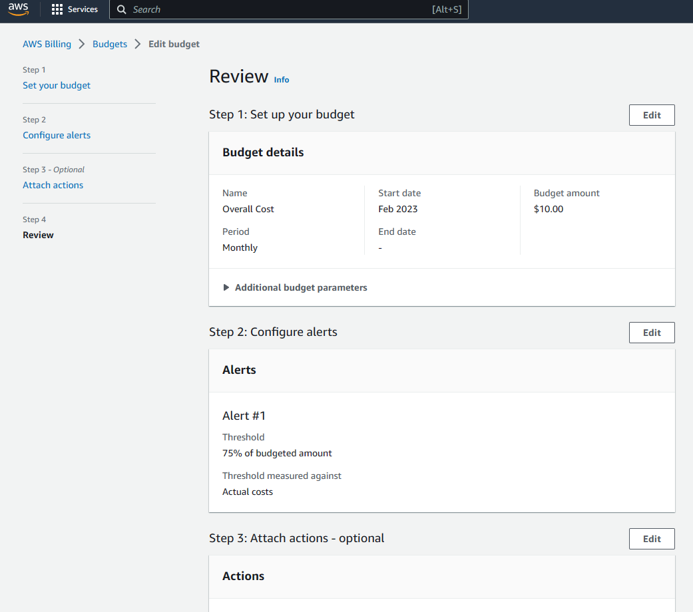

# Week 0 — Billing and Architecture

## Homework for week 0 : 

1. Set a Billing alarm - Dollar amount. 
    

2. Create an AWS Budget - Credits with an 80% threshold alert. 

3. Activating MFA in a new user create. Also, add policies to the new admin account

4. 