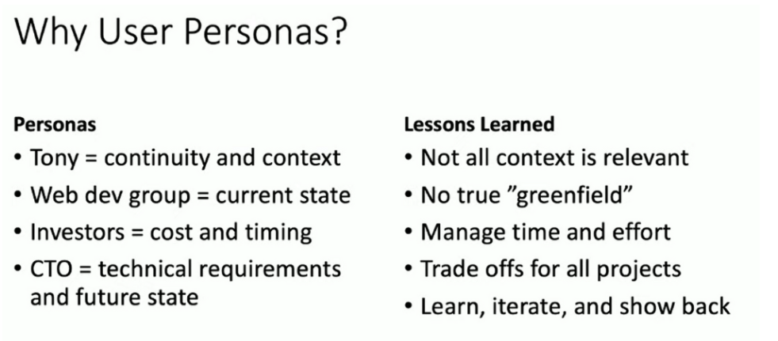

# Week 0 — Billing and Architecture

## Live Lecture February 11th, 2023

### Business Case 

Tony - Hiring Manager

Sam - Owner of the startup 

We got hired by startup company in which we will be in charged of the application development and the implementation of AWS services to scale this application. There is a considerable amount of pressure because the company has a limited budget. The investors are also looking to see a finished product that can reach a bigger amount of users. 

As part of the introduction, we learned that a Monolithic Application is a big one unit that has all its components tied to each other. Everything is condensed in one place. We are trying to build a microservice, which means that we will need to decouple those components. We want to separate User Interface, Business logic and Data access. 

As a side note - We always got to consider the triangle below. Why? Because this is what needs to be explain to upper management when they are requesting a project. When lacking money, then they cannot expect something cheap but also high quality and fast. 

We also need to be mindful of budget when spending in infrastructure. As mentioned above, budget is a little tight.  

### Technical Architecture - Chris' Portion 

Meet the requirements - Assess requirements, so go over risks, assumptions and constraints, etc. 

- These need to be verifiable, monitorable, traceable, and feasible.

For these type of projects, it is important to do the following: 

- Ask “dumb questions”
- play be-the-packet - Think as a data packet and how it travels through the infrastructure. It will be easier to understand what the system is lacking.
- Document everything - Specially adding comments to pieces of code. Many non-technical people should be able to understand what is going on.

### Pre-built diagram

Logical Architecture 

## Creating Billing Alerts

- When creating an alert, it is very important to be on the N. Virginia Region. Otherwise, Billing data won’t show.
- It is good practice to use tags so it is easier to figure out what exact resource is spending the most. It is another way to have more granular data.
    - These tags could be regions, owners, environments, etc.

## Homework for week 0 : 

1. Set a Billing alarm - Dollar amount. 

Added billing alert using Cloudwatch. Set up the alarm so it would send me an email in case the 80% of my budget was reached.   

2. Create an AWS Budget - Credits with an 80% threshold alert. 

Very similar to the billing alert, I created a $10 budget that will notify me if I go past 75% of it. 

3. Activating MFA in a new user create. Also, added policies to the new admin account

4. Watched Ashish Rajan Cloud Security Best Practices video 

## AWS Security Best Practices Video

As part of the homework exercise, I wanted to summarize the most important points that Ashish covered during his lecture. First of all, the video was really easy to follow and understand. That said, here is what I got out of it. 

Cloud Security - Cybersecurity that protects the data, apps and services associated to the cloud. 

- We should care to reduce impact of breaches. Also, to protect assets hosted in the cloud.

### Adding MFA to Root Account

This is very important because the “Root User” is the most powerful user in your AWS environment. If the root account gets compromised, then it’s game over. 

### Create an Org Unit

With this option, users can create multiple accounts using AWS Organizations. This was a great option to segregate the accounts and improved security. 

### Enabling CloudTrail

Cloudtrail is an auditing service. It monitors data security and residence. For this service, we need to understand the region vs AZs vs Global services concepts. For example, if you are tracking services using Cloudtrail, it is important to track the appropriate regions. Otherwise, those won’t be recorded. 

### Create IAM User

There are 3 kinds of user in AWS. When creating these users, the principle of least privilege should be applied. This principle basically helps giving users the appropriate level of access. Instead of giving full access to all the accounts, we need to make sure users get the right access to the right services. Along these lines, MFA should be enabled to all of the accounts as best practice. 

### IAM Roles

It is important to understand the difference between IAM roles and policies. Roles are the permission assigned directly to AWS services. Now, policies can be attached to a group of users or organizations. To reiterate, it is always good practice to apply the principle of least privilege. 

### Enable AWS Organization SCP

These are a type of organization policies that can be used to manage permissions in the organizations. The advantage of this is the centralization of managing permissions. For this option, it is really important to understand the share responsibility model.

### Summary - Security Best Practices

1. Data protection and Residency in accordance to Security Policy
2. IAM with least privilege 
3. Governance and Compliance of AWS Services being used
    a. Global vs Regional Services
    b. Compliant Services
4. Shared Responsibility of Threat Detection. 
5. Incident Response plans to include Cloud